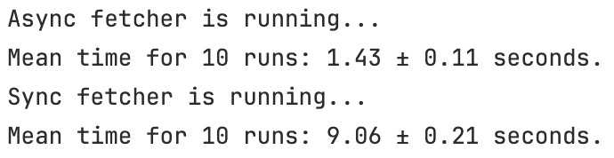

# Async vs Sync Programming

- In this repo, I will be comparing the performance of async and sync programming in Python. I will be using the `requests` library to make HTTP requests to five endpoints of World Bank's api to get metadata info of countries, capitals, population, land square, military expenditure, military personnel information.

- When tried to get data of countries, for each info more than 5 requests are made because there are more than 250 countries and in each query 50 are returned (can be increased but not on purpose to achieve a bottleneck).
  - When a usual programming is applied, every request is run sequentially which means each awaits another to be finished.
  - When async programming is applied, every request is run concurrently which means each does not await another to be finished. That reduces the time elapsed to get the whole results.
- Here are the real execution results for 10 runs for each.
